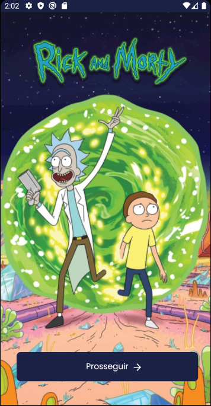
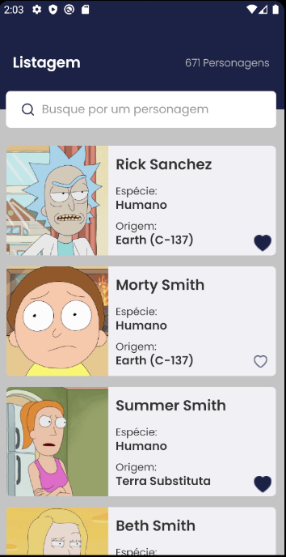
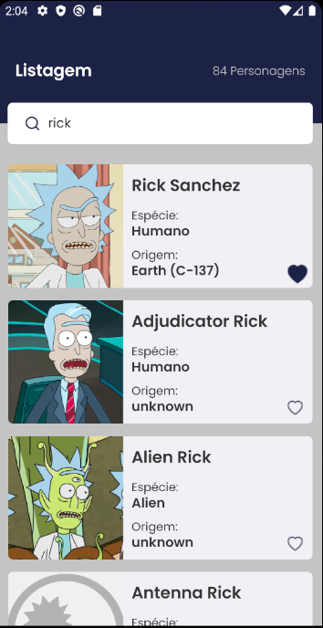
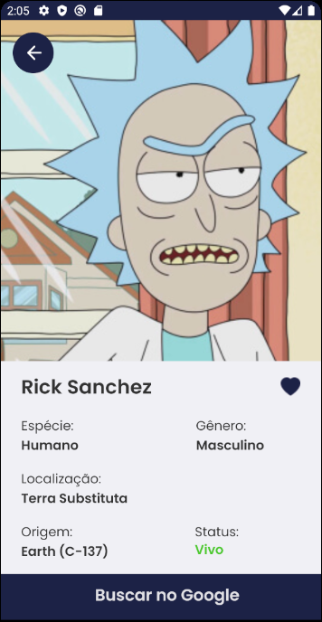

<div align="center">
  
</div>

## RickMortyApp

<h4 align="center">
  RickMortyApp é um App criado para busca de personagens da série televisiva Rick and Morty.
</h4>

<div>
<p align="center">


</p>
<p align="center">


</p>
</div>

## Tecnologias

- [ReactJS](https://reactjs.org/)
- [React-Native](https://reactnative.dev/)
- [Typescript](https://www.typescriptlang.org/)
- [Axios](https://axios-http.com/docs/intro)
- [ReactNavigation](https://reactnavigation.org/)
- [AsyncStorage](https://react-native-async-storage.github.io/async-storage/)
- [Styled-Components](https://styled-components.com/)

## 💻 Começando

### Requisitos

- Você precisa instalar [Node.js](https://nodejs.org/en/download/) e [Yarn](https://yarnpkg.com/) e ter um ambiente android configurado na sua maquina para rodar este projeto.

**Clone o projeto e acesse a pasta:**

```bash
$ git clone https://github.com/MiDrAjX/RickAndMortyApp.git && cd RickAndMortyApp
```

**Siga os passos a seguir:**

```bash
# Instale as dependencias
$ yarn || npm install

# Inicie o Metro
$ yarn start || npm start

# Com o emulador ou celular conectado use o comando para instalar o aplicativo no dispositvo:
$ npx react-native run-android
```

O aplicativo vai estar disponível na tela do seu dispositivo.

## 💻 Funcionalidades

### 💻 Listagem de personagens "Scroll Infinito"

<div>
<h3 align="center">Ao chegar ao fim da lista são carregados novos personagens.</h3>
<p align="center">

</p>
</div>

### 💻 Filtro por nome de personagem

<div>
<h3 align="center">Para Filtrar deve-se inserir o nome que deseja e clicar na lupa ou no submit do teclado;</h3>
<p align="center">

</p>
<h4 align="center">Para retornar a lista de todos basta limpar o campo do filtro e clicar na lupa ou no submit do teclado.</h4>
</div>

### 💻 Like consistente nos personagens

<div>
<h3 align="center">Clicar no símbolo de coração para realizar o like/deslike do personagem O estado fica salvo no asyncStorage.</h3>
<p align="center">

</p>
</div>

Feito com 💜 por Jeison Marques 👋 [Dá uma olhada no meu linkedin](https://www.linkedin.com/in/jeison-marques/)
